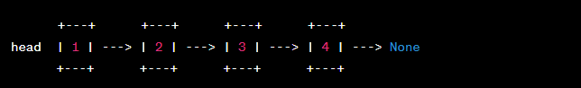

# Linked List

## Introduction:

Let's say you are building a music player application, and you want to create a playlist feature. Each song in the playlist can be represented as a node in a linked list.

## Definition:

A linked list is a linear data structure consisting of a sequence of elements, called nodes, where each node contains data and a reference (or link) to the next node in the sequence. The linked list is characterized by its dynamic nature and flexibility in size.
## 

## Music Player:

Lets go back and talk about building a music player application and why that is applicable to this. This time around I'm not going to bore you with images I will instead throw in the code so you can see what it looks like on the backend. 
```python

class Song:
    def __init__(self, title, artist):
        self.title = title
        self.artist = artist
        self.next_song = None

class Playlist:
    def __init__(self):
        self.head = None

    def add_song(self, title, artist):
        new_song = Song(title, artist)
        if self.head is None:
            self.head = new_song
        else:
            current_song = self.head
            while current_song.next_song is not None:
                current_song = current_song.next_song
            current_song.next_song = new_song

    def display_playlist(self):
        current_song = self.head
        while current_song is not None:
            print(f"Title: {current_song.title}, Artist: {current_song.artist}")
            current_song = current_song.next_song

```

Now you might be thinking, what does all of that mean and what is everything doing? So let me break it down for you. 

* We have 2 Classes; Song and Playlist, each "Song" has objects tied to it that are called properties, and in this snippet those properties are; 'title' and 'artist' and those get referenced to 'next_song'
* The Playlist class has a head attribute that points to the first song in the playlist. When you (the user) add a new song to the playlist using the add_song method, the method creates a new Song object and updates the next_song reference of the last song in the playlist to point to the new song.
* The display_playlist method travels through the linked list, starting from the head, and prints out the title and artist of each song in the playlistn and oila you have your Music Player. 

Basically, in layman's terms, this example shows us how a linked list, can be used to represent a playlist in a music player application, where each song is linked to the next song in the list.

# Usability:

Lets get into the nitty gritty, are these linked lists actually useful? Are they efficient? What are some drawbacks? Lets talk about it. 

## Advantages 

* Dynamic Size: Linked lists can grow or shrink dynamically,this is useful for when the information is constantly changing, or just simply unpredictable
* Insertion and Deletion: Insertion and deletion operations at arbitrary positions. Let me explain that a little better. Basically that means; accessing, inserting, or deleting elements at any desired location within the linked list, without any specific pattern or predetermined order. Arbitrary is a weird word. 

## Limitation(s)

* Additional Memory Overhead: Linked lists require extra memory to store the references or pointers for linking the nodes together. This additional memory overhead can be a disadvantage in situations where memory usage is a concern.

## Efficient? 

So we can see the pros and the cons, but is it efficient? Sure. But at the same time no. They have obvious advantages which are excelling in dynamic size scenarios (remember that means everything can change or be unpredictable), insertion and deletion is rather simple, and linked lists are quite flexible when it comes to memory management. So there is an obvious trade off, you can stick to what they are great with and raise your hands and say "linked lists are efficient" or you can go down the path of sadness and be bogged down. They're great at what they're great at, and no bad at what they're bad at. 

# Options within a Linked List:

Within the Linked List data structure we have quite a few ways to use it effectively, they are listed as such. 

* Insertion
* Deletion
* Searching
* Traversal

There are obviously many more ways to implement Linked Lists but these are the ones that I have seen to be common.


# Coding CHALLENGE (Get ready for those jobs Interviews...)

Write a function in Python that takes a linked list as input and returns the middle node of the list. If the list has an even number of nodes, consider the second middle node as the result.

For example, given the linked list: 1 -> 2 -> 3 -> 4 -> 5, the function should return the node with the value 3.

# Solution

```python
class Node:
    def __init__(self, value):
        self.value = value
        self.next = None


def find_middle_node(head):
    slow = head
    fast = head

    while fast is not None and fast.next is not None:
        slow = slow.next
        fast = fast.next.next

    return slow
```