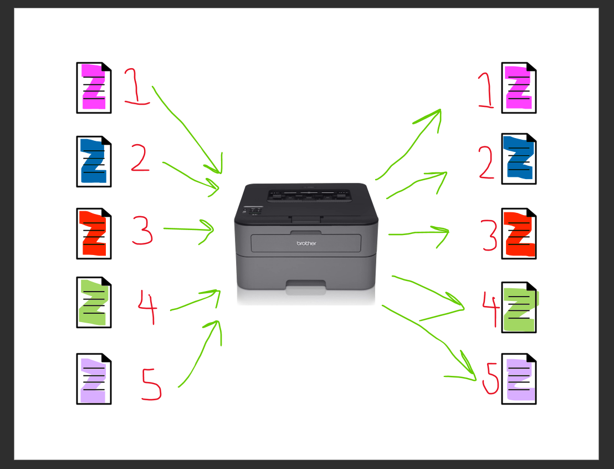

# Queue

## Introduction:

Imagine you are standing in a line to buy your ticket or check out your items. The line forms a queue where people join at the back and are served or attended to in the order they arrived. In this scenario, the first person who arrives at the line is the first to be served, while the others wait their turn in a sequential order. As each person is served or finishes their transaction, the next person in line moves forward, and the process continues until everyone is served. 

## Definition:

A queue follows the "First-In-First-Out" (FIFO) principle, where the item or person who joins the queue first is the first to be processed or served. This concept is applicable not only in physical lines but also in various computer systems, where tasks, requests, or data are managed in a similar manner.
## 

## Printer:

Maybe that picture was a little boring for you, it was for me at least, however I do know that we have all struggled when we are in line at the McKay library waiting for something to print,so let me break down to you with the following example.  In a library environment, multiple users may send print jobs to a printer at the same time. To manage these print requests efficiently, a queue-based system called a print spooler is used. When a user sends a print job, it is added to the end of the print queue. The print spooler then processes the jobs one by one, following the "First-In-First-Out" (FIFO) principle. The first print job that entered the queue is the first to be printed, while the subsequent jobs wait their turn. Just like a physical queue, the print spooler ensures that the print jobs are processed in the order they were received. This helps prevent conflicts, ensures fairness, and maintains the integrity of the print order.
## 

# Usability:

Talking about lines, and printers is fun, but in all reality Queues are usful for a myriad of reasons, some being listed below. 
* Order and fairness: Queues follow the "First-In-First-Out" (FIFO) principle, ensuring that items are processed or serviced in the order they arrive. This characteristic is beneficial when maintaining order and fairness is important, such as managing tasks, requests, or events.
* Synchronization and coordination: Queues are often used in multithreaded or concurrent programming to synchronize and coordinate operations between different parts of a program. Threads can enqueue or dequeue items from a shared queue, ensuring proper sequencing and avoiding race conditions.
* Buffering and flow control: Queues can act as buffers, allowing efficient handling of data or events when the production rate differs from the consumption rate. For example, in networking applications, queues can hold incoming data packets while they await processing or transmission.
* Task management: Queues are handy for managing and scheduling tasks or jobs in various systems. For instance, in job scheduling or task processing systems, a queue can hold pending tasks until resources become available for their execution.
* Event-driven systems: Queues are often used in event-driven architectures to handle incoming events or messages. Events are added to a queue, and the system processes them sequentially, ensuring that no events are missed or skipped.

Overall, queues provide an efficient and organized way to handle data, tasks, and events in programming, allowing programmers to write reliable, scalable, and well-coordinated systems.

# Options within Queue:

Within the queue data structure we have quite a few ways to use it effectively, they are listed as such. 

* Enqueue: This operation adds an element to the end of the queue. The new element becomes the last item in the queue, and subsequent elements are shifted forward.
* Dequeue: This operation removes the element at the front of the queue and returns it. The next element in line becomes the new front of the queue.
* Peek or Front: This function allows you to access the element at the front of the queue without removing it. It is useful for examining the next item to be processed.
* IsEmpty: This function checks if the queue is empty and returns a boolean value indicating whether there are any elements in the queue.
* Size: This function returns the number of elements currently in the queue, providing information about the queue's length or size. 

These basic operations and functions allow programmers to manipulate and interact with queues efficiently.

# Example Code

## 

# Coding CHALLENGE (Get ready for those jobs Interviews...)

Implement a Queue class that supports the following methods:

* enqueue(item): Add an item to the end of the queue.
* dequeue(): Remove and return the item at the front of the queue.
* is_empty(): Return a boolean indicating whether the queue is empty.
* size(): Return the number of elements in the queue.

# Solution

## 