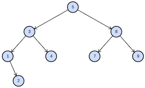

# Tree Data Structure

## Introduction:

Imagine a family tree as a real-life example of a Python tree data structure. In a family tree, you have a root node representing the oldest generation (ancestors), and each following generation (parents, children, grandchildren) forms branches connected to their respective parents. Each individual in the family tree is a node, and the relationships between them are represented by the tree's hierarchical structure.

## Definition:

A Python tree data structure represents a hierarchical collection of nodes, where each node can have multiple child nodes but only one parent node.
## 

## Family Tree:

Lets go back and talk about building a music player application and why that is applicable to this. This time around I'm not going to bore you with images I will instead throw in the code so you can see what it looks like on the backend. 
```python

class TreeNode:
    def __init__(self, name):
        self.name = name
        self.children = []

    def add_child(self, child):
        self.children.append(child)

def print_tree(node, level=0):
    indent = "    " * level
    print(f"{indent}{node.name}")
    for child in node.children:
        print_tree(child, level + 1)

# Creating the family tree
grandfather = TreeNode("Grandfather")
father = TreeNode("Father")
mother = TreeNode("Mother")
child1 = TreeNode("Child 1")
child2 = TreeNode("Child 2")
child3 = TreeNode("Child 3")

grandfather.add_child(father)
grandfather.add_child(mother)
father.add_child(child1)
father.add_child(child2)
mother.add_child(child3)

# Printing the family tree
print_tree(grandfather)

```
## Explanation

Now you might be thinking, what does all of that mean and what is everything doing? So let me break it down for you step by step of what is going on here: 

* We start by defining a simple class TreeNode to represent each node in the family tree. Each node has a name attribute to store the individual's name and a children list to store references to its child nodes.
* We define an add_child method in the TreeNode class to add a new child node to an existing node. This method appends the child node to the children list of the parent node.
* We create a function called print_tree to traverse the family tree and print its structure. It uses recursion to print each node and its children in a hierarchical way, adding indentation to indicate the level of each node in the tree.
* We create instances of the TreeNode class to represent the individuals in the family tree. In this example, we have a "Grandfather" node with two children ("Father" and "Mother"), and each child has their own children ("Child 1," "Child 2," and "Child 3").
* Finally, we call the print_tree function, passing the root node ("Grandfather") as the starting point to print the entire family tree.

Basically, in layman's terms, we are creating a basic representation of a tree data structure to model family relationships. A tree data structure is a "hierarchical" collection of nodes, where each node has a parent node (except for the root node) and zero or more child nodes. It is called a "tree" because it resembles a tree with branches extending from a single root.

# Usability:

Lets get into the nitty gritty, are these trees actually useful? Are they efficient? What are some drawbacks? Lets talk about it. 

## Advantages 

* Trees are excellent for organizing hierarchical data, making it easy to represent parent-child relationships or nested structures.
* Trees can be memory-efficient when working with large datasets or when the tree has a well-balanced structure.

## Disadvantages

* Trees require additional memory to store pointers or references for each node, which can become a concern when working with massive datasets.
* While trees are versatile, they might not be the best choice for all scenarios. Graphs or hash maps might be more suitable for certain applications.

## Efficient? 

So we can see the pros and the cons, but is it efficient? Sure. But at the same time no. The efficiency of trees depends on various factors, including the specific type of tree, its structure, and the operations being performed on it. Different types of trees have different characteristics and performance profiles, and some may be more efficient than others for specific tasks. Much like queues and linked lists, each one of these data structures will excel in their own area while seriously struggling in others, it is our job, yes that includes you, to find out where they will succeed and just move forward in that area. 

# Options within a Tree Data Structure:

Within the Tree data structure we have quite a few ways to use it effectively, they are listed as such. 

* Binary Tree
* Expression Tree 

There are obviously many more ways to implement Trees but these are the ones that I have seen to be common, and that I feel comfortable talking about. 


# Coding CHALLENGE (Get ready for those jobs Interviews...)

 Implement a Binary Tree data structure with the ability to add nodes and perform in-order traversal.

# Solution

```python
class TreeNode:
    def __init__(self, value):
        self.value = value
        self.left = None
        self.right = None

class BinaryTree:
    def __init__(self):
        self.root = None

    def add_node(self, value):
        if not self.root:
            self.root = TreeNode(value)
        else:
            self._add_node_recursively(self.root, value)

    def _add_node_recursively(self, node, value):
        if value < node.value:
            if node.left:
                self._add_node_recursively(node.left, value)
            else:
                node.left = TreeNode(value)
        else:
            if node.right:
                self._add_node_recursively(node.right, value)
            else:
                node.right = TreeNode(value)

    def in_order_traversal(self):
        elements = []
        self._in_order_traversal_recursively(self.root, elements)
        return elements

    def _in_order_traversal_recursively(self, node, elements):
        if not node:
            return
        self._in_order_traversal_recursively(node.left, elements)
        elements.append(node.value)
        self._in_order_traversal_recursively(node.right, elements)

# Example usage:
tree = BinaryTree()
tree.add_node(5)
tree.add_node(3)
tree.add_node(7)
tree.add_node(2)
tree.add_node(4)
tree.add_node(6)
tree.add_node(8)

print("In-order traversal:", tree.in_order_traversal())

```